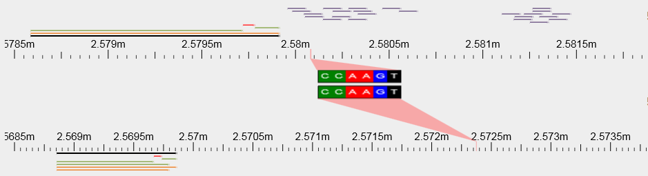

A sequence region comparison visualization which uses the Scribl HTML5 canvas library (http://chmille4.github.com/Scribl/).


Usage
------
```js
var browser = new SyntenyBrowser(document.getElementById('browser'));
var seq1 = browser.addSequence('ACTCATGCTAGTGCTAGCTAGCTAGCTAGCTAGCTAGCT', 1);
var seq2 = browser.addSequence('ATGCTAGCTAGTGGGTGGATCGTGATGCTAGTAGCTAGCTAGCTAGCTAGATATGCCGTACGTCGTAG', 10);

browser.draw();

var region1 = seq1.selectRegion(5, 12); // SelectRegion hilights the position on the sequence scale
var region2 = seq2.selectRegion(34, 41);

// let's assume region1 and region2 are known to by syntenic
region1.projectWith(region2); // Project sequence contained at these two regions. You could also project the alignment by hosting a file 'pairwise_align.php' which provides the alignment (using the included script/blast.sh bash script) and calling "compareWith"
```

Files
------
  * vendor/Scribl.1.1.3.min.js: Library which powers the synteny browser
  * syntenybrowser.js: The synteny browser
  * script/blast.sh: Script to use in conjunction with your own 'pairwise_align.php' hosted on your server (this is only required to use the "region.compareWith" function)
  * example/test.html: Short example of how to use the synteny browser
  * example/projection.png: Screenshot of the synteny browser used in a production environment

TODO
----
  * Fix upper region hilighting so that it consistently falls on the sequence scale
